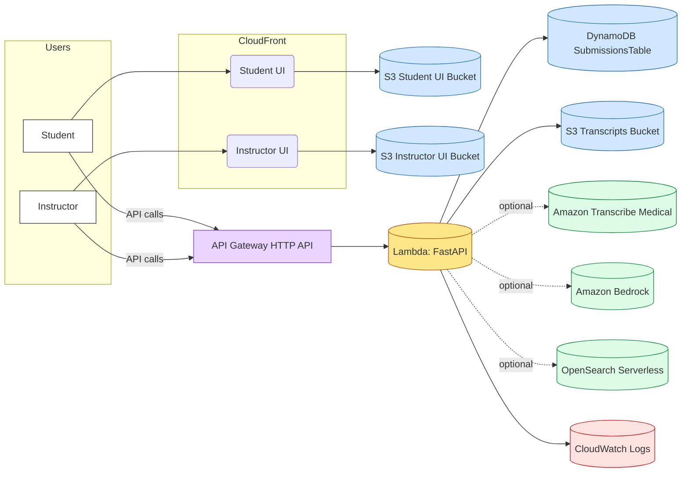

# System Architecture – Med‑Ed OP Grader (Simple English)

This document explains the system in simple Indian English. It shows the big parts, how they talk to each other, and the main data flow from audio to final score.

## What the system does
- Students record or upload an oral presentation (OP) for a clinical case.
- The system transcribes audio, cleans (sanitizes) text, checks quality, analyses content, and gives rubric‑based scores with evidence and feedback.
- Instructors and students see results in web apps.

## Main components (high level)
- Two Single‑Page Apps (SPAs)
  - Student UI (React/Vite) – static website hosted on S3 and delivered via CloudFront
  - Instructor UI (React/Vite) – static website hosted on S3 and delivered via CloudFront
- API (FastAPI on AWS Lambda via Mangum), fronted by Amazon API Gateway HTTP API
- Storage
  - Amazon S3 “Transcripts” bucket for audio, raw transcript, sanitized text, and analysis/score JSON
  - Amazon DynamoDB table `SubmissionsTable` for submission metadata and status
- AI/ML and Search (scaffolded/configured)
  - Amazon Transcribe Medical for transcription jobs (optional path)
  - Amazon Bedrock for extraction models (e.g., Anthropic Claude) and Titan embeddings
  - Amazon OpenSearch Serverless (AOSS) for retrieval/index (future phases)
- Observability & Security
  - Amazon CloudWatch Logs for API/Lambda logs
  - IAM roles and least‑privilege statements
  - S3 server‑side encryption, CloudFront OAI to keep UI buckets private
- CI/CD
  - GitHub Actions workflow uses Serverless Framework to deploy infra and function code

## High‑level architecture diagram


## End‑to‑end data flow (from audio to score)


## API overview (key endpoints)
- GET `/health` – health check
- POST `/submissions` – create or fetch a submission record; accepts `audio_key` or `transcript_key`
- POST `/upload_url` – get pre‑signed S3 URL for direct audio upload
- POST `/transcribe/start` and `/transcribe/status` – manage Transcribe Medical jobs
- POST `/sanitize` – store sanitized text and update status
- POST `/analyze/{submission_id}` – compute sections, timeline, pertinents, summary, ddx and save `analysis.json`
- POST `/score/{submission_id}` – compute rubric scores, feedback, EPA; save `score.json`
- GET `/score/{submission_id}` – fetch latest score

## Storage layout (S3 and DynamoDB)
- S3 (Transcripts bucket)
  - Partition prefix: `test_id=submissions/YYYY/MM/DD/submission_id=<uuid>` (example pattern)
  - Keys under a submission:
    - `audio/<file>.wav` – uploaded audio (optional)
    - `transcribe/json.json` – raw Transcribe job JSON (optional)
    - `transcribe/raw.txt` – extracted plain text
    - `sanitized/text.txt` – cleaned, de‑identified text
    - `eval_json/analysis.json` – analysis result
    - `eval_json/score.json` – final score and feedback
- DynamoDB `SubmissionsTable`
  - PK: `submission_id` (string)
  - Fields (examples): `test_id`, `status`, `status_history[]`, `audio_key`, `transcript_key`, `sanitized_key`, `analysis_key`, `score_key`, `word_conf_summary`, timestamps

## Configuration and environment
- Defined in `serverless.yml` under `provider.environment`:
  - `SUBMISSIONS_TABLE`, `S3_BUCKET_TRANSCRIPTS`, `STAGE`
  - Transcribe: `TRANSCRIBE_MEDICAL`, `TRANSCRIBE_LANGUAGE`
  - Retrieval/Embeddings: `OPENSEARCH_COLLECTION`, `OPENSEARCH_INDEX`, `BEDROCK_EMBED_MODEL`
  - Extraction LLM: `BEDROCK_MODEL_EXTRACTOR`
  - Scoring prompts: `PROMPT_BUNDLE_ID`
  - Guardrails: `GUARDRAILS_ID`

## Security and privacy (summary)
- S3 buckets encrypted (SSE AES‑256); UI buckets private, served via CloudFront with Origin Access Identity (OAI)
- API Lambda role has least‑privilege access to S3/DynamoDB/Transcribe/Bedrock/AOSS as needed
- CORS set to `*` for demo; lock down in production
- Do not commit secrets; use AWS SSO and OIDC for CI (see `docs/SECURITY.md`)
- Sanitization removes simple names/dates/phones before analysis

## CI/CD pipeline

- Workflows:
  - `infra-deploy.yml`: assumes AWS role via OIDC, installs Serverless, deploys stack and function
  - `api-smoke.yml`: quick remote smoke checks against API URL

## Non‑functional notes
- Scalability: Serverless (Lambda/API GW/DDB/S3/CloudFront) scales automatically
- Cost: Pay‑per‑use. Idle costs mainly S3 storage and minimal DynamoDB
- Reliability: CloudFront caching for UI; stateless API; durable S3 and DDB
- Observability: CloudWatch Logs; consider metrics/alarms in future phases

## Future phases (from README Roadmap)
- Retrieval (OpenSearch + Bedrock extractors) and stronger guardrails
- Rich scoring rules, fairness/stability checks, and SLOs
- Security hardening with VPC/KMS + audit trails

## Glossary
- Submission: One student attempt; stored in DynamoDB with related S3 keys
- Sanitization: Remove control chars, simple PII, normalize lines
- Analysis: Find HPI bounds, timeline events, pertinents, summary, DDx
- Scoring: Deterministic rubric scoring + feedback + EPA suggestions


## Subsystem architecture (simple English)

### Frontend subsystem (Student UI and Instructor UI)
- Tech: React + Vite + TypeScript; hosted on S3; served by CloudFront (OAI)
- Responsibilities
  - Student UI: create submission, upload audio via pre‑signed URL, trigger sanitize/analyze/score, view evidence
  - Instructor UI: view results, summaries, and evidence (same API)
- Integration
  - All server calls go to API Gateway → Lambda
  - Direct S3 uploads use a pre‑signed PUT URL from the API

```mermaid
flowchart LR
  Student --> StudentSPA[Student SPA]
  Instructor --> InstructorSPA[Instructor SPA]
  StudentSPA -->|REST| APIGW[API Gateway]
  InstructorSPA -->|REST| APIGW
  note right of StudentSPA: Uses pre‑signed S3 upload for audio
```

### Backend subsystem (FastAPI on Lambda)
- Entry: API Gateway HTTP API → Lambda (Mangum) → FastAPI app
- Main modules and roles
  - app.py: endpoints, orchestration, S3/DDB calls, status updates
  - models.py: DynamoDB access (get/update submission)
  - sanitize.py: strip control chars, basic de‑ID, normalize
  - gatekeeper.py: simple checks for minimum lines/tokens
  - analysis.py: sectioner, timeline, pertinents, summary, DDx
  - scoring.py: deterministic scoring rules
  - epa.py: EPA suggestions, feedback.py: feedback composition

```mermaid
flowchart TB
  APIGW[API Gateway] --> LBD[(Lambda)] --> APP[FastAPI (app.py)]
  APP --> MODELS[models.py (DynamoDB)]
  APP --> SAN[sanitize.py]
  APP --> GK[gatekeeper.py]
  APP --> ANA[analysis.py]
  APP --> SCO[scoring.py]
  APP --> EPA[epa.py]
  APP --> FB[feedback.py]
  APP --> S3[(S3 Transcripts)]
  APP --> DDB[(DynamoDB Submissions)]
  APP -.optional.-> TRS[(Transcribe Medical)]
  APP -.optional.-> BED[(Bedrock)]
  APP -.future.-> AOSS[(OpenSearch Serverless)]
```

### Data subsystem (S3 + DynamoDB) and statuses
- S3 keys per submission: audio/, transcribe/json.json, transcribe/raw.txt, sanitized/text.txt, eval_json/analysis.json, eval_json/score.json
- DynamoDB item keyed by submission_id with status history
- Submission status state machine


### Transcribe pipeline (detailed)


### Analysis pipeline (detailed)


### Scoring pipeline (detailed)


### Environments and configuration
- Stages: dev (default), can add staging/prod
- Region default: us‑east‑1 (configurable)
- serverless.yml provides env vars for S3/DDB, Transcribe, Bedrock, AOSS, and prompt bundle IDs
